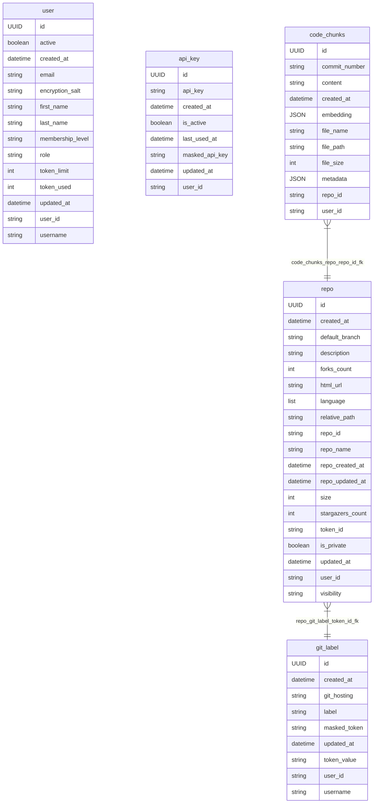

# Supabase Integration & Usage Guide

[](https://supabase.com)
[](https://www.postgresql.org/docs/)
[](https://www.python.org/downloads/release/python-3120/)
[](https://tortoise.github.io/)
[](https://tortoise.github.io/migration.html)
[](https://github.com/tembo-io/pgmq)

This README documents how Supabase is integrated and used across our system, both as a **primary database** and a **queueing engine**.

It outlines everything needed to understand, configure, and work with Supabase in our architecture, including:

- How Supabase is accessed and used within the codebase
- Where and how environment variables and credentials are configured
- How to perform database migrations
- How our queueing mechanism works using Supabase tables and triggers
- A full Entity Relationship Diagram (ERD) of our current schema

Whether you're working on ingest pipelines, API services, or internal tools, this document serves as a reference for every technical aspect of Supabase's role in our architecture.

---

## 📘 Table of Contents

- [📘 Database Schema Overview (PostgreSQL via Supabase)](#-database-schema-overview-postgresql-via-supabase)
- [📘 System Architecture Overview](#-system-architecture-overview)
- [📘 Setting Up a Supabase Project](#-setting-up-a-supabase-project)
- [📘 Glossary](#-glossary)

---
## 📘 Database Schema Overview (PostgreSQL via Supabase)

Our database schema is currently implemented on **PostgreSQL** through Supabase. This section outlines the structure of the database, including core tables, message queues, and relationships between entities.

Our database is structured across two main schemas:

- `public`: Contains core application data models such as users, repositories, code chunks, and API keys
- `pgmq`: Contains automatically generated message queue tables created via the `pgmq` PostgreSQL extension

Each schema is documented below in its own section, with diagrams and commentary to help understand its purpose and structure.

---

### 📄 `public` Schema

This is the primary schema that holds application data like user accounts, credentials, ...etc. It’s the most frequently accessed schema by the API layer and background workers.

---

#### 📝 Entity Relationship Diagram


🔍 Jump to Table Definitions:
- [`user`](#-publicuser-table)
- [`api_key`](#-publicapi_key-table)
- [`git_label`](#-publicgit_label-table)
- [`repo`](#-publicrepo-table)
- [`code_chunks`](#-publiccode_chunks-table)
---

#### 📝 Table Definitions

Each table is explained in detail below.

##### ➤ `public`**.**`code_chunks` table

**▸ Description:**

Stores individual code fragments (a.k.a. “chunks”) extracted from a Git repository. These chunks are used for downstream processing like embedding, vectorization, and retrieval.

**▸ Fields:**

| Field           | Type      | Description                                                |
|-----------------|-----------|------------------------------------------------------------|
| `id`            | UUID (PK) | Auto generated table Primary Key                           |
| `user_id`       | String    | User identifier using clerk authentication                 |
| `repo_id`       | String    | Repository this chunk belongs to (refers to `repo.id`).    |
| `content`       | Text      | The actual code/content of the chunk.                      |
| `embedding`     | JSON      | The chunk’s vector representation (nullable).              |
| `metadata`      | JSON      | Additional metadata about the chunk (default: empty dict). |
| `file_name`     | String    | Name of the file this chunk came from.                     |
| `file_path`     | String    | Path of the file in the repo.                              |
| `file_size`     | Integer   | Size of the full file (not just the chunk).                |
| `commit_number` | String    | Git commit ID for this snapshot of the file.               |
| `created_at`    | Datetime  | Timestamp of when the chunk was created.                   |

**▸ Relationships:**

- code_chunks_repo_repo_id_fk :: public.code_chunks.repo_id → public.repo.id

---

##### ➤ `public`**.**`repo` table

**▸ Description:**

Stores metadata about Git repositories pulled from GitHub/GitLab. One repository belongs to one user, and may be used for chunking, indexing, and analytics.

**▸ Fields:**

| Field              | Type            | Description                                                            |
|--------------------|-----------------|------------------------------------------------------------------------|
| `id`               | UUID (PK)       | Auto generated table Primary Key                                       |
| `user_id`          | String (Unique) | User identifier using clerk authentication                             |
| `repo_id`          | String          | Repository ID from Git provider (e.g., GitHub repo ID).                |
| `repo_name`        | String          | Repository name (e.g., `my-app`).                                      |
| `description`      | Text            | Optional description of the repo.                                      |
| `html_url`         | String          | URL to the repository homepage.                                        |
| `default_branch`   | String          | Default Git branch (usually `main`).                                   |
| `forks_count`      | Integer         | Fork count (from Git API).                                             |
| `stargazers_count` | Integer         | Star count (from Git API).                                             |
| `is_private`       | Boolean         | Whether the repository is private.                                     |
| `visibility`       | String          | Visibility string from GitLab (e.g., `internal`, `private`, `public`). |
| `token_id`         | String          | Refers to `git_label.id`, the token used to access the repo.           |
| `repo_created_at`  | Datetime        | Original repo creation time.                                           |
| `repo_updated_at`  | Datetime        | Original repo last update.                                             |
| `language`         | JSON            | Primary languages used (as list of names, no %).                       |
| `size`             | Integer         | Size of `.git` contents in bytes.                                      |
| `relative_path`    | String          | Path relative to platform domain (e.g., `user/repo`).                  |
| `created_at`       | Datetime        | Record creation timestamp.                                             |
| `updated_at`       | Datetime        | Record update timestamp.                                               |


**▸ Constraints:**

- Unique constraint: (user_id, repo_id)
- Indexed on: (user_id, created_at)


**▸ Relationships:**

- code_chunks_repo_repo_id_fk :: public.code_chunks.repo_id → public.repo.id 
- repo_git_label_token_id_fk :: public.repo.token_id → public.git_label.id 

---

##### ➤ `public`**.**`git_label` table

**▸ Description:**

Stores access credentials (like tokens and usernames) to Git hosting platforms such as GitHub or GitLab. Each token can be labeled (named) and belongs to a specific user.

**▸ Fields:**

| Field          | Type      | Description                                             |
|----------------|-----------|---------------------------------------------------------|
| `id`           | UUID (PK) | Auto generated table Primary Key                        |
| `user_id`      | String    | User identifier using clerk authentication              |
| `label`        | Text      | Friendly label for this credential (e.g., "My GitHub"). |
| `git_hosting`  | String    | Hosting provider (`github`, `gitlab`, etc).             |
| `username`     | Text      | Username on the hosting provider service.               |
| `token_value`  | Text      | Hashed token used to authenticate.                      |
| `masked_token` | Text      | Obfuscated version of the token for UI use.             |
| `created_at`   | Datetime  | Record creation timestamp.                              |
| `updated_at`   | Datetime  | Record update timestamp.                                |

**▸ Constraints:**

- Unique constraint: (user_id, git_hosting, masked_token)

**▸ Relationships:**

- repo_git_label_token_id_fk :: public.repo.token_id → public.git_label.id 

---

##### ➤ `public`**.**`api_key` table

**▸ Description:**

Stores API keys issued for programmatic access to our backend services. These keys belong to specific users and can be revoked.

**▸ Fields:**

| Field            | Type      | Description                                |
|------------------|-----------|--------------------------------------------|
| `id`             | UUID (PK) | Auto generated table Primary Key           |
| `user_id`        | String    | User identifier using clerk authentication |
| `api_key`        | String    | Full API key value.                        |
| `masked_api_key` | String    | Obfuscated version of the API key.         |
| `is_active`      | Boolean   | Whether the key is still valid.            |
| `created_at`     | Datetime  | Record creation timestamp.                 |
| `updated_at`     | Datetime  | Last update timestamp.                     |
| `last_used_at`   | Datetime  | When this key was last used (if ever).     |

---

##### ➤ `public`**.**`user` table

**▸ Description:**

Stores metadata about users, retrieved and synced from Clerk (auth provider). All other tables link to this one via `user_id`.

**▸ Fields:**

| Field              | Type      | Description                                    |
|--------------------|-----------|------------------------------------------------|
| `id`               | UUID (PK) | Auto generated table Primary Key               |
| `user_id`          | String    | User identifier using clerk authentication     |
| `first_name`       | String    | User's first name.                             |
| `last_name`        | String    | User's last name.                              |
| `email`            | String    | Email address.                                 |
| `username`         | String    | Optional username (default: "").               |
| `role`             | String    | Role within the platform (admin/user/etc).     |
| `active`           | Boolean   | Whether the user account is active.            |
| `membership_level` | String    | Membership level (e.g., `free`, `premium`).    |
| `token_limit`      | Integer   | Monthly token quota for usage.                 |
| `token_used`       | Integer   | Monthly token consumption so far.              |
| `encryption_salt`  | String    | Salt value used for encrypting sensitive data. |
| `created_at`       | Datetime  | Record creation timestamp.                     |
| `updated_at`       | Datetime  | Last update timestamp.                         |

---

### 📄 `pgmq` Schema

This schema is automatically created and managed by the `pgmq` PostgreSQL extension. It contains internal queue tables used for asynchronous task processing.

For an in-depth explanation of what `pgmq` is, how it structures its queues, and how Supabase enhances it, [see the Glossary → What is pgmq?](#-what-is-pgmq).

The following table exists once pgmq is enabled and the pgmq schema is created:
- `pgmq.meta` — Contains the Metadata for all created queues

The following tables are generated everytime a new queue is created:
- `pgmq.q_<queue_name>` — Active message queue
- `pgmq.a_<queue_name>` — Archived (dead-letter) queue


These tables are not manually created, they are auto-generated when a queue is declared using `pgmq.create()` or Supabase queue tools.

> *Note: Queue table names will appear dynamically in the schema based on the queue names you define during setup.*

---

#### 📝 Queue Definitions:

> Note: Refer to [How to create a Queue in Supabase](#-apply-and-manage-queue-schema) Guide to check how to create a Queue.

##### ➤ `processing` Queue

**▸ Purpose:**  
Used for ingestion tasks, enqueued when a GitHub/GitLab repository is submitted via the portal.

**▸ Payload Format (JSON):**
```json
{
    "payload": {
      "context_id": "123",
      "branch": "main",
      "config": {},
      "repo_id": "1012348217",
      "user_id": "user_2xioBPMzrTczyKDABvynLeToHst",
      "priority": 1,
      "git_token": "fd767782-de3a-4e5f-8a95-9d411531436c",
      "git_provider": "github",
      "relative_path": "montymobile1/devdox-ai-encryption"
    },
    "job_type": "analyze"
  }
```

**▸ Payload Field Descriptions:**

| Field           | Type    | Description                                                                       |
|-----------------|---------|-----------------------------------------------------------------------------------|
| `context_id`    | String  | Unique ID used internally to track the job being handled by the consumer.         |
| `branch`        | String  | Git branch to pull (usually `"main"` or `"master"`).                              |
| `config`        | Object  | Optional config overrides for the consumer (e.g., chunking rules).                |
| `repo_id`       | String  | GitHub/GitLab repository ID (from their API).                                     |
| `user_id`       | String  | Clerk user ID who owns this repository.                                           |
| `priority`      | Integer | priority level for future scheduling logic.                                       |
| `git_token`     | String  | ID of the token stored in `public.git_label` table, used to access private repos. |
| `git_provider`  | String  | `"github"` or `"gitlab"`, determines which provider                               |
| `relative_path` | String  | Git repo path                                                                     |
| `job_type`      | String  | Job type indicator: `"analyze"` or `"process"` (used by consumer).                |

---

### 📄 `pgmq_public` Schema
[see the Glossary → What is pgmq_public schema?](#-what-is-the-pgmq_public-schema).

---

## 📘 System Architecture Overview

This section offers a bird's-eye view of the microservices and shared components in our architecture, and how they interact with the Supabase backend.

---

### 📄 Architecture Diagram

```mermaid
graph TD
    subgraph Supabase
        DB[(PostgreSQL DB)]
        Queues[(pgmq Queues)]
    end

    Models_Package["📦 devdox-ai-models (Python Package)"]
    Tembo_Library["tembo_pgmq_python (Python Library)"]


    PortalAPI["🌐 devdox-ai-portal-api (Microservice)"]
    Context["🧠 devdox-ai-context (Microservice)"]

    PortalAPI --> Models_Package
    Context --> Models_Package
    Context --> Tembo_Library

    Models_Package -->|CRUD| DB

    Tembo_Library -->|Queue Access | Queues


```



---

### 📄 Key Components

- `devdox-ai-models` package: Shared Python package housing Tortoise ORM models and reusable DB logic.

- `devdox-ai-portal-api` microservice: Microservice that provides the user-facing API layer and performs DB operations via the models package.

- `devdox-ai-context` microservice: Backend processing microservice that also uses the models package, and consumes tasks from Supabase queues via tembo_pgmq_python.

- `tembo_pgmq_python` python library: [Tembo's Python client](https://github.com/pgmq/pgmq/tree/main/tembo-pgmq-python) for interacting with pgmq-based queues in PostgreSQL. Used exclusively by devdox-ai-context to consume and manage asynchronous jobs.

- `Supabase`: Acts as both a PostgreSQL database and a message queue engine (via the pgmq extension). Provides authentication, REST APIs, and developer tooling on top of PostgreSQL.


---

## 📘 Setting Up a Supabase Project

This section walks you through creating and configuring a Supabase project which would be used in project

### 📄 via Supabase Web

This section walks you through creating and configuring a Supabase project via the official Supabase dashboard

- Go to https://supabase.com/dashboard

- Click “New project”

- Choose:
  - Organization: (your org name)
  - Project name: (e.g., devdox-ai-dev)
  - Database password: Choose a strong password
  - Choose the region closest to you

---

### 📄 Initialize/Manage The Database via UI

#### 📝 Setting Up Database Connection with application

**➤ Get Your Supabase URL:**

1. Select your project from the dashboard.

2. In the left sidebar, click on “Project Settings” (gear icon at the bottom).

3. Go to the “Data API” tab.

4. Under API Settings, you’ll see:
    - Project URL → This is your Supabase URL (e.g., https://your-project-id.supabase.co)
    - This is your RESTful endpoint for querying and managing your database

**➤ Get Database connection properties:**

- While in the dashboard of the created project, at the top of the screen in the menu, click on `Connect`

- A window will open with different connection types:
  - **Direct connection**: Require paid IPv4 support, which is unavailable in most environments.
  - **Transaction pooler**: May fail or behave unexpectedly with ORMs like Tortoise or SQLAlchemy that use PREPARE statements or long-lived sessions.
  - **Session pooler**: is safe, stable, and IPv4-proxied by default.

- We will be working with `Session Pooler`, you need to note down everything related to it, these are the options we will use in our application `.env` files, like:
  - `host`
  - `port`: usually `5432`
  - `database`: usually `postgres`
  - `user`
  - `password`: its the Database password we created in [step 1 -- Create a New Project on Supabase](#1-create-a-new-project-on-supabase)

**➤ Getting Database restful secret key:**

We need this key since it grants full access to your Supabase database via RESTful APIs.

How to get it:
1. In the **left sidebar**, scroll down and click on **`Project Settings`** (gear icon).
2. Navigate to the **“API Keys”** tab.
3. Under the **“API Keys”** section, you will find:
   - `anon` public key
   - `service_role` key → **This is the one you need**
4. **Copy the `service_role` key** and store it securely in your `.env` file or secrets manager.

**➤ Finally:**
Collect all these and add them to your configuration files to make it possible to connect to your database

---

#### 📝 Apply and Manage Database Schema

There are two ways to initialize and manage a database schema:
- Manually via SQL Editor or Table Editor (Supabase UI)
- Automated Using the Migration Script (Recommended Method)

**➤ Automated Using the Migration Script** (Recommended Method):

The project uses an automated migration system powered by `Tortoise ORM` and `Aerich`. This system handles both:
- Initial database setup (first-time deployment)
- Ongoing migrations when schema changes are made

The microservice `devdox-ai-portal-api` includes a script named `run_migrations.py`, which safely applies all migrations in order. What It Does:
- Initializes the database schema on first run (if tables are missing)
- Applies all Aerich-generated migration files
- Ensures Tortoise ORM connections are cleanly opened and closed
- Prevents partial initialization if an error occurs

To Run It Locally:
you need to go to `devdox-ai-portal-api`, then in the terminal, run the following command:
```terminaloutput
python3 run_migrations.py
```
Make sure your configuration file is correctly configured with the Session Pooler connection settings and Supabase credentials (from Step 2).


**➤ Manually via SQL Editor or Table Editor:**

Supabase provides two manual ways to create tables:
- Via SQL editor:
  1. In the **left sidebar**, click on **`SQL Editor`**.
  2. Simply use DDL SQL commands to create the tables manually

- Via Table Editor
  1. In the **left sidebar**, click on **`Table Editor`**.
  2. Click on `New Table` and follow the instructions

> Check [Database Schema Overview -- public schema section](#-public-schema) to see what you need to create

---

#### 📝 Apply and Manage Queue Schema

There is no way to communicate and send DDL commands even via `run_migration.py` script, which is an intentional PostgreSQL design, even the supabase `pgmq_public` is not allowed to do DDL operations, so, we have to create them manually

---

**➤ Enable Queue in Supabase:**

Supabase, uses Queues system via postgresql `pgmq` extension, but, by default, Supabase does not have it installed. We have to install it, to do that:

1. In the **left sidebar**, click on **`Integrations`**.
2. In the List of integrations, search for `Queues` and enable it

**➤ Enable Queue communication over APIs:**

By default, even if you install Queues via `pgmq`, they remain unexposed to API use, thus we cant communicate with the Queues via Restful APIs, to enable this we need:

1. Once you have enabled the `Queues`, in the menu pane for `Integrations` on the left, click on `Queues` menu 
2. Go to `Settings` in the `Queues` page 
3. Enable `Expose Queues via PostgREST` 

This step will add a new light-weight schema called `pgmq_public`, this is supabase specific work-around around the limitation of `pgmq` not being exposed by design

**➤ Create the Queues in the Database:**

> Check [Database Schema Overview -- pgmq schema Queue Definitions section](#-queue-definitions) to see what you need to create, you only need the name

1. In the menu pane for `Integrations` on the left, click on `Queues` menu 
2. Go to `Queues` in the `Queues` page
3. Click on `Create a Queue`
   - You only need to give the Queue a name 
   - Now, depending on your use case, pick whether you want to create a `Basic` or `Unlogged` queue, in our project we will create mostly `Basic` Queues, [see the Glossary → Difference between `Basic` and `Unlogged` Queues](#-what-is-the-difference-between-basic-and-unlogged-queues)

This is where pgmq system will automatically create `pgmq.a_<queue name>` and `pgmq.q_<queue name>`, and will add a metadata record to `pgmq.meta` about the queue

---

## 📘 Glossary

### 📄 What is `pgmq`?

[`pgmq` (PostgreSQL Message Queue)](https://github.com/pgmq/pgmq) is an **open-source PostgreSQL extension** that adds **message queue capabilities** to PostgreSQL. It is **not native** to PostgreSQL but rather an **external extension** that must be manually installed and enabled if you're using vanilla PostgreSQL.

- Without Supabase: You'd need to manually install `pgmq` (via `CREATE EXTENSION pgmq;`) and then call its queue-related functions yourself.
- With Supabase: Supabase provides an **out-of-the-box integration**, enabling you to use `pgmq` easily via the UI or APIno need to install or wire it up manually. [READ MORE about SUPABASE-PGMQ Integration](https://supabase.com/docs/guides/database/extensions/pgmq)

---

#### 📝 **What does `pgmq` create internally before and after a queue is created?**

Once pgmq extension is added to postgresql, it generates a new schema called `pgmq`. This schema includes:

1. **`meta`**:  
   - Stores metadata about all created queues.  
   - Is always created in a `pgmq` schema automatically

2. **`q_<queue_name>`**:  
   - This is the **main active message queue**. 
   - generated when a queue is created, if, for example, a queue is named `"processing"` is created, pgmq generates `pgmq.q_processing`

3. **`a_<queue_name>`**:  
   - This is the **archived/dead-letter queue**.  
   - Same structure as `q_` but includes an `archived_at` timestamp.
   - generated when a queue is created, if, for example, a queue is named `"processing"` is created, pgmq generates `pgmq.a_processing`

These are not Supabase-specific inventions here, **they're part of how the `pgmq` extension structures its queues**.

---

#### 📝 **What is the `pgmq_public` schema?**
When you enable the pgmq extension, there's no direct way to interact with the pgmq schema via APIs even when using the PostgreSQL extension PostgREST.

To bridge this gap, Supabase introduces a Supabase-specific enhancement: when you enable PostgREST access for the pgmq schema, Supabase automatically creates a new schema called `pgmq_public`.

This schema is not part of the official pgmq PostgreSQL extension. Instead, it acts as a public-facing interface that exposes selected parts of pgmq to external clients via REST API, while maintaining a separation of concerns.

Although pgmq_public behaves like a normal schema, it’s recommended not to modify or add custom objects and tables to it. Supabase maintains it as a lightweight, intermediary layer that safely connects external API requests with the underlying pgmq system.

---

### 📄 What is the Difference between `Basic` and `Unlogged` Queues?

`Basic` and `Unlogged` are a PostgreSQL specific feature, they are two types of database tables, where the difference between them is in the usage of a PostgreSQL Concept called Write-Ahead Logging (WAL).

---

#### 📝 **What is Write-Ahead Logging (WAL)**

WAL is a mechanism in postgresql where when doing add, update, delete, DDL operations, it keeps a separate history record of it on Disk

If the operation completes but crashes before it persists the changes on the database, WAL resumes the operation once the database is back online and working. 

If the operation never completes, then its discarded by WAL. 

WAL saves its records in a persistent location. However, in Read-only binary form, we are not supposed to do anything with it, its an internal mechanism used by PostgreSQL, we can still read it but it will be in binary thus we need to use `PGWalDump`. 

#### 📝 **What is `Basic` and `Unlogged`?**

There are two types of tables in postgresql: 

- `Basic`: a logged table that uses WAL, its the default tables created by postgresql whenever the DDL operation `CREATE TABLE ....` is used. Its a bit slower since WAL has to save its own data in alongside saving to Database. 
- `Unlogged`: Does not use the WAL mechanism, this makes it lose track immediately on a crash or restart. It has a special DDL command to create `CREATE UNLOGGED TABLE .....`

---

## 📅 Changelog

| Date       | Change Description                          | Author                  |
|------------|---------------------------------------------|-------------------------|
| 2025-07-10 | Initial version                             | Mohammad Ali Jaafar     |